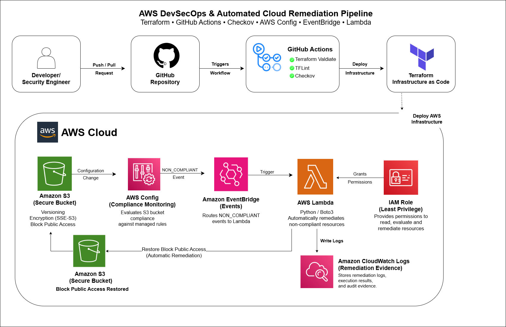
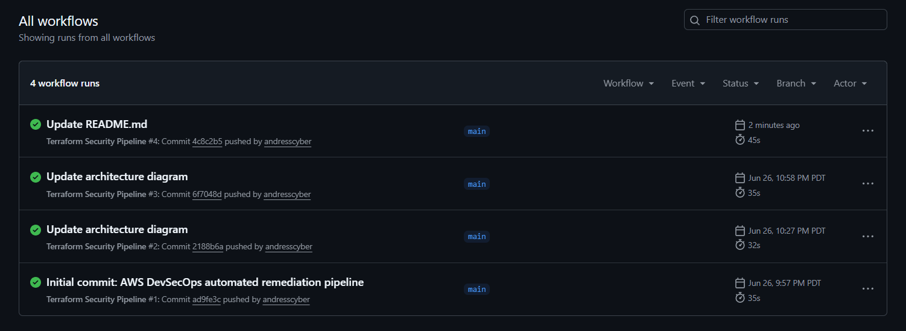
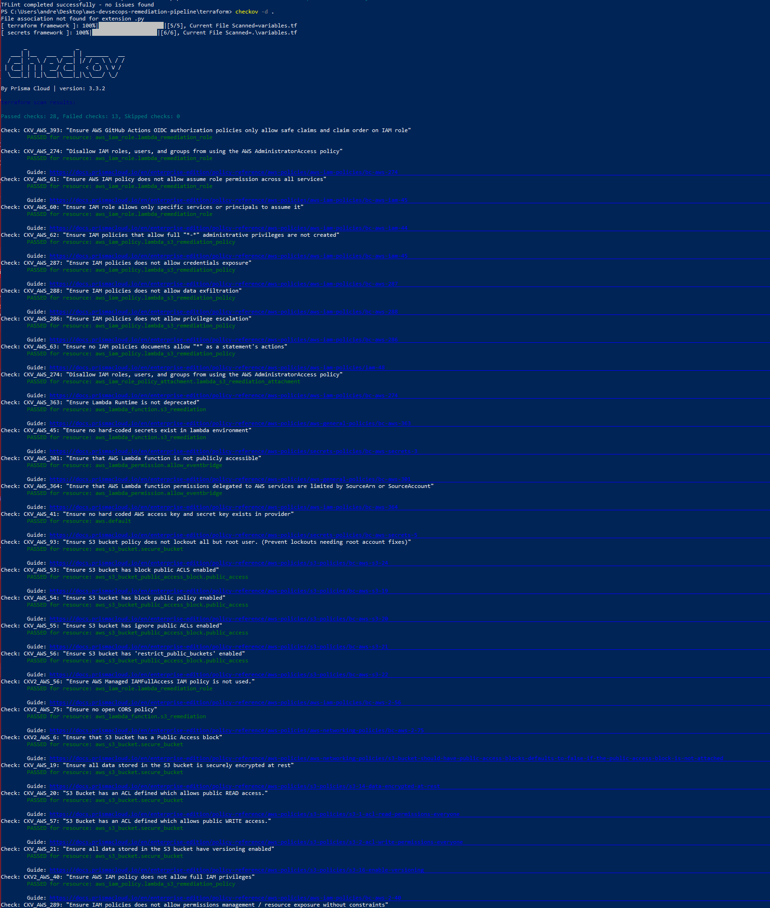
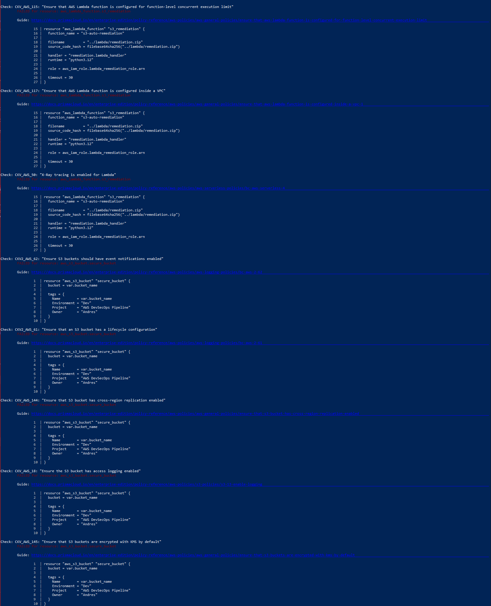
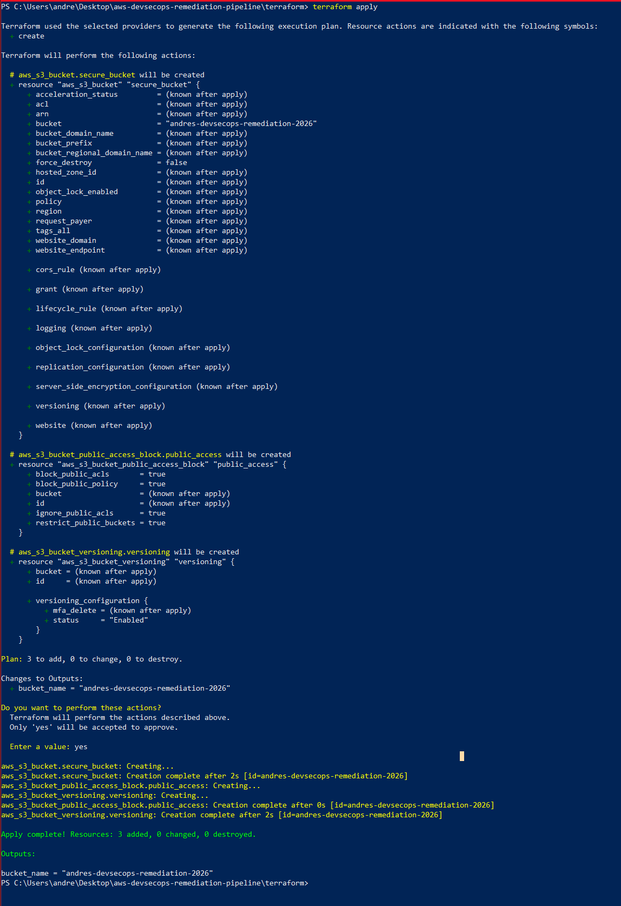
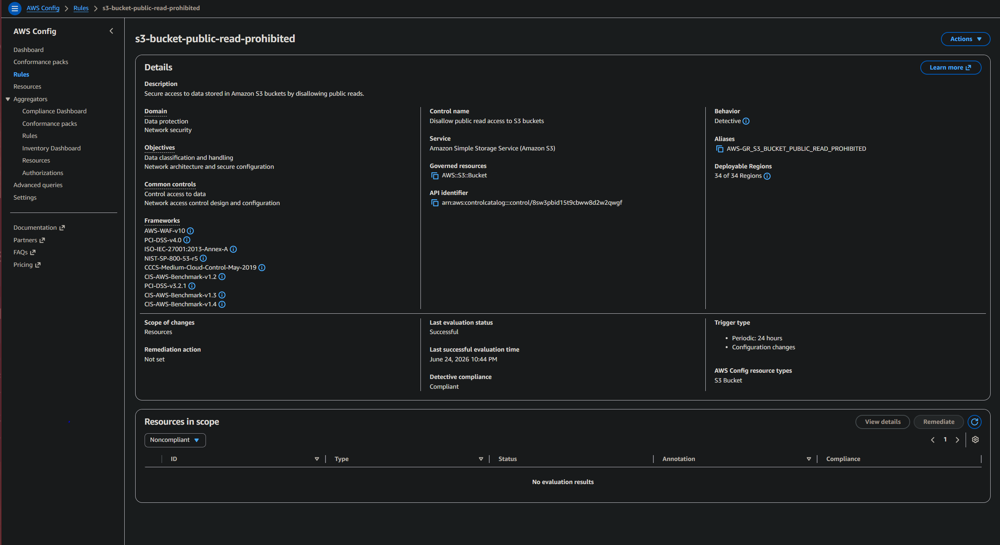
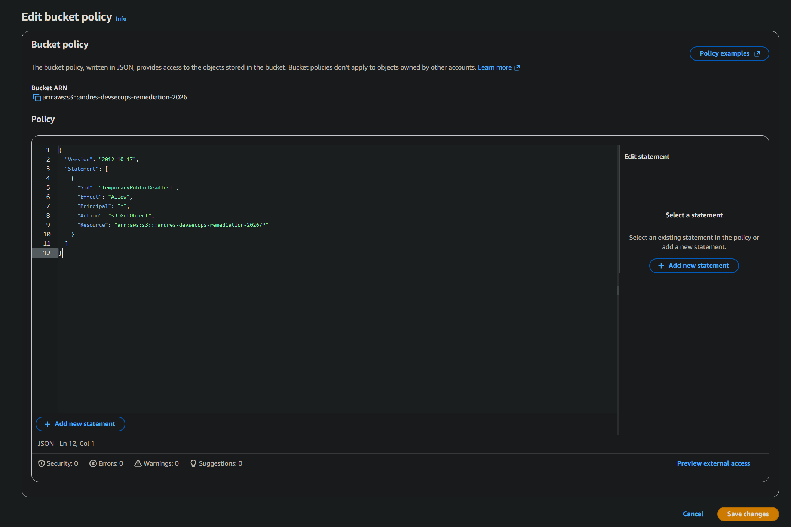
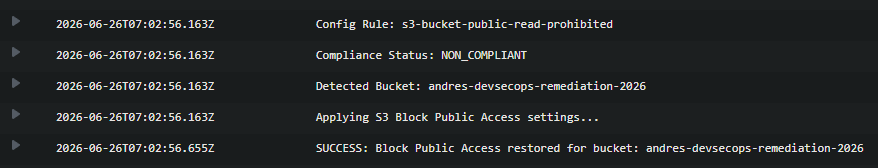

# AWS DevSecOps Automated Cloud Remediation Pipeline


---
<p align="center">
<strong>Terraform • GitHub Actions • Checkov • AWS Config • EventBridge • Lambda • CloudWatch</strong>
</p>

## Overview

This project demonstrates the design and implementation of an **event-driven AWS DevSecOps pipeline** that continuously validates Infrastructure as Code (IaC), monitors cloud resource compliance, and automatically remediates insecure Amazon S3 configurations.

Infrastructure is provisioned using **Terraform** and validated through a CI/CD pipeline utilizing **GitHub Actions**, **Checkov**, and **TFLint** before deployment. Once deployed, **AWS Config** continuously evaluates the security posture of an Amazon S3 bucket against managed compliance rules.

When a bucket becomes non-compliant—for example, by allowing public read access—**Amazon EventBridge** automatically routes the compliance event to an **AWS Lambda** function. The Lambda function restores Amazon S3 Block Public Access settings using the AWS SDK for Python (Boto3). All remediation activity is recorded in **Amazon CloudWatch Logs**, providing operational visibility and auditability.

This project demonstrates modern cloud security engineering practices including Infrastructure as Code, DevSecOps automation, continuous compliance monitoring, event-driven remediation, least privilege IAM design, and serverless cloud security automation.

---

# Solution Architecture

<p align="center">

</p>

**Figure 1.** High-level architecture illustrating the complete DevSecOps workflow from Infrastructure as Code validation through automated AWS cloud remediation.

---

## Architecture Flow

```text
Developer
      │
      ▼
GitHub Repository
      │
      ▼
GitHub Actions
      │
      ├──────── Terraform Validate
      ├──────── TFLint
      └──────── Checkov Security Scan
                    │
                    ▼
Terraform Apply
                    │
                    ▼
──────────────── AWS ────────────────
                    │
                    ▼
Secure Amazon S3 Bucket
                    │
                    ▼
AWS Config
(Continuous Compliance Monitoring)
                    │
                    ▼
Amazon EventBridge
(Event Routing)
                    │
                    ▼
AWS Lambda
(Automatic Remediation)
                    │
                    ▼
Restore S3 Block Public Access
                    │
                    ▼
Amazon CloudWatch Logs
(Audit & Visibility)
```

---

# Project Objectives

This project was designed to simulate a modern cloud security engineering workflow by combining Infrastructure as Code, automated security validation, compliance monitoring, and serverless remediation into a single security pipeline.

---

## Objectives

- Deploy secure AWS infrastructure using Terraform
- Validate Infrastructure as Code before deployment
- Perform automated security scanning using Checkov
- Perform Terraform linting using TFLint
- Implement Infrastructure as Code best practices
- Enforce least privilege IAM permissions
- Monitor S3 bucket compliance using AWS Config
- Detect cloud misconfigurations automatically
- Trigger serverless remediation through Amazon EventBridge
- Restore secure S3 configuration automatically using AWS Lambda
- Record remediation events within Amazon CloudWatch Logs
- Demonstrate real-world cloud security automation

---

# Technology Stack

| Category | Technologies |
|-----------|-------------|
| Cloud | AWS |
| Infrastructure as Code | Terraform |
| Programming | Python (Boto3) |
| CI/CD | GitHub Actions |
| IaC Security | Checkov |
| Terraform Linting | TFLint |
| Compliance Monitoring | AWS Config |
| Event Routing | Amazon EventBridge |
| Serverless Compute | AWS Lambda |
| Storage | Amazon S3 |
| Monitoring | Amazon CloudWatch |
| Identity & Access Management | AWS IAM |
| Version Control | Git & GitHub |

---

# Security Capabilities Demonstrated

- Infrastructure as Code using Terraform
- Shift-left security scanning with Checkov
- Terraform linting with TFLint
- CI/CD security validation with GitHub Actions
- Secure S3 bucket deployment with versioning and encryption
- Continuous compliance monitoring with AWS Config
- Event-driven remediation with Amazon EventBridge
- Serverless remediation using AWS Lambda and Boto3
- Least privilege IAM role design
- CloudWatch logging for remediation evidence
- Preventive, detective, and corrective cloud security controls

---

# Security Engineering Decisions

| Decision | Why It Was Used |
|----------|-----------------|
| Terraform | Provides repeatable, version-controlled Infrastructure as Code instead of manual AWS console configuration. |
| GitHub Actions | Automatically validates infrastructure changes before deployment. |
| Checkov | Scans Terraform for security misconfigurations early in the development lifecycle. |
| TFLint | Detects Terraform quality issues and best-practice violations. |
| AWS Config | Continuously evaluates deployed resources against compliance rules. |
| EventBridge | Routes compliance events only when relevant changes occur, avoiding inefficient polling. |
| Lambda | Provides serverless remediation without maintaining EC2 instances. |
| IAM Least Privilege | Limits the remediation function to only the permissions required to restore S3 Block Public Access. |
| CloudWatch Logs | Provides operational visibility, troubleshooting data, and audit evidence. |

---

# Security Control Mapping

| Security Control | Implementation |
|------------------|----------------|
| Preventive Controls | Terraform, GitHub Actions, Checkov, TFLint |
| Detective Controls | AWS Config Managed Rule (`s3-bucket-public-read-prohibited`) |
| Corrective Controls | Amazon EventBridge, AWS Lambda |
| Audit & Visibility | Amazon CloudWatch Logs |
| Identity & Access Management | Least Privilege IAM Role |

---

# Repository Structure

```text
aws-devsecops-remediation-pipeline/
│
├── .github/
│   └── workflows/
│       └── terraform-security.yml
│
├── architecture/
│   └── 01-overall-architecture.png
│
├── lambda/
│   ├── remediation.py
│   └── remediation.zip
│
├── screenshots/
│   ├── 01-github-actions/
│   ├── 02-checkov/
│   ├── 03-tflint/
│   ├── 04-terraform-deployment/
│   ├── 05-aws-config/
│   └── 06-auto-remediation/
│
├── terraform/
│   ├── config.tf
│   ├── iam.tf
│   ├── main.tf
│   ├── outputs.tf
│   ├── s3.tf
│   ├── terraform.tfvars
│   └── variables.tf
│
├── README.md
└── .gitignore
```

---

# Project Walkthrough

## 1. Infrastructure Deployment with Terraform

Terraform provisions all AWS resources required for the automated remediation pipeline, including the secure Amazon S3 bucket, IAM role, AWS Lambda function, Amazon EventBridge rule, and AWS Config resources.


The S3 bucket is deployed with security controls enabled by default, including versioning, server-side encryption, and Block Public Access.

## 2. CI/CD Security Validation

GitHub Actions runs Terraform validation, TFLint, and Checkov to validate infrastructure code before deployment.

This demonstrates shift-left security by identifying configuration and security issues before infrastructure changes are applied.

## 3. Continuous Compliance Monitoring

AWS Config evaluates the S3 bucket using the managed rule `s3-bucket-public-read-prohibited`.

If the bucket allows public read access, AWS Config marks the resource as `NON_COMPLIANT`.

## 4. Event-Driven Remediation

Amazon EventBridge listens for AWS Config compliance change events.

The EventBridge rule is scoped to trigger only when the `s3-bucket-public-read-prohibited` rule reports a `NON_COMPLIANT` result.

## 5. Automated Remediation with Lambda

The Lambda function receives the AWS Config event, extracts the affected S3 bucket name, and restores Block Public Access settings using Boto3.

## 6. Audit Evidence with CloudWatch

CloudWatch Logs record the event payload, compliance status, affected bucket, and remediation result.

---

# Evidence & Screenshots

## GitHub Actions

<p align="center">

</p>

**Figure 1:** GitHub Actions automatically validates Terraform configuration, executes TFLint, and performs Checkov security analysis before infrastructure deployment.

## Checkov Security Scan

<p align="center">

</p>

**Figure 2:** Checkov scans the Terraform configuration for Infrastructure as Code security misconfigurations and compliance issues.

<p align="center">

</p>

**Figure 3:** Detailed Checkov scan results highlighting Infrastructure as Code security validation.

## TFLint Validation

<p align="center">

</p>

**Figure 4:** TFLint validates Terraform syntax and configuration best practices with no issues detected.

## Terraform Deployment

<p align="center">

</p>

**Figure 5:** Terraform provisions AWS infrastructure including the S3 bucket, IAM role, Lambda function, EventBridge rule, and AWS Config resources.

## AWS Config Compliance Rule

<p align="center">

</p>

**Figure 6:** AWS Config managed rule continuously evaluates the Amazon S3 bucket for public read access compliance.

## Automated Remediation

<p align="center">

</p>

**Figure 7:** A temporary public bucket policy is applied to intentionally simulate a cloud security misconfiguration.

<p align="center">

</p>

**Figure 8:** CloudWatch Logs confirm that AWS Lambda detected the NON_COMPLIANT event and automatically restored Amazon S3 Block Public Access.

---

# Lessons Learned

This project reinforced how preventive, detective, and corrective cloud security controls work together in a real-world AWS environment.

Key lessons learned:

- Terraform defines secure infrastructure as code.
- Checkov and TFLint help validate infrastructure before deployment.
- AWS Config detects configuration drift after deployment.
- EventBridge enables event-driven security automation.
- Lambda can automatically remediate misconfigurations without human intervention.
- IAM least privilege reduces risk by limiting remediation permissions.
- CloudWatch provides evidence that remediation occurred successfully.

---

# Future Improvements

- Add SNS or Slack notifications for remediation events
- Add AWS CloudTrail correlation for identifying who made the change
- Add AWS Security Hub integration
- Add support for remediating open security groups
- Use AWS KMS encryption for stricter key management requirements
- Store Terraform state remotely in S3 with DynamoDB state locking
- Expand GitHub Actions to block deployment on high-severity Checkov findings

---

# Skills Demonstrated

- AWS Cloud Security
- DevSecOps
- Infrastructure as Code (Terraform)
- GitHub Actions CI/CD
- Checkov Security Scanning
- Terraform Validation & TFLint
- AWS Config Compliance Monitoring
- Amazon EventBridge
- AWS Lambda (Python/Boto3)
- IAM Least Privilege
- Amazon S3 Security
- CloudWatch Logging
- Event-Driven Architecture
- Security Automation
- Continuous Compliance

---
